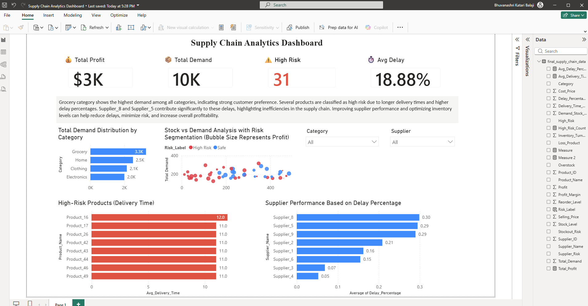

# Supply Chain Risk & Performance Analysis (End-to-End Analytics)

## Project Type

End-to-End Data Analytics Dashboard

---

## 🎯 Business Problem

Supply chain inefficiencies such as delivery delays, high-risk products, and inconsistent supplier performance can lead to revenue loss and operational disruptions.

This project aims to:
- Identify delay patterns across suppliers
- Detect high-risk products based on delivery time
- Analyze demand distribution for better inventory planning
- Improve supplier performance evaluation

---

## Overview

This project presents an interactive Power BI dashboard designed to analyze and optimize supply chain performance. It provides insights into demand distribution, supplier efficiency, delivery delays, and product risk levels.

---

## Live Preview

Download the `.pbix` file and open it in Power BI Desktop to explore the interactive dashboard.

---

## Key Features

* KPI tracking (Profit, Demand, Delay %, High Risk Products)
* Demand analysis by product category
* Supplier performance based on delay percentage
* High-risk product identification using delivery time
* Interactive filters (Category & Supplier)
* Top N analysis and DAX-based measures

---

## ⚙️ Data Processing & Analysis (Python)

- Cleaned and processed supply chain dataset using Pandas
- Created derived metrics:
  - Delay Percentage
  - Risk Classification (High / Medium / Low)
  - Supplier Performance Score
- Performed exploratory analysis to identify patterns in delays and demand

---

## Tools Used

* Power BI
* DAX (Data Analysis Expressions)
* Data Visualization

---

## 🚀 Business Impact

- Identified key suppliers contributing to delivery delays, enabling targeted performance improvements
- Highlighted high-risk products affecting supply chain stability
- Provided data-driven insights to improve inventory planning and reduce operational risk
- Created a scalable dashboard for continuous monitoring of supply chain performance

---

## 📊 Key Insights

- Grocery category shows consistently high demand, indicating strong consumption patterns and priority stocking needs
- Certain suppliers exhibit significantly higher delay percentages, highlighting operational inefficiencies
- High-risk products are strongly correlated with longer delivery times and supply instability
- Supplier performance variability suggests potential for optimization through better vendor selection
- Improving supplier efficiency and inventory planning can reduce delivery risk and increase overall profitability

---

## Dashboard Preview

---

## How to Use

1. Download the `.pbix` file from this repository
2. Open it using Power BI Desktop
3. Use slicers (Category & Supplier) to interact with the dashboard
4. Explore KPIs and visual insights

---
